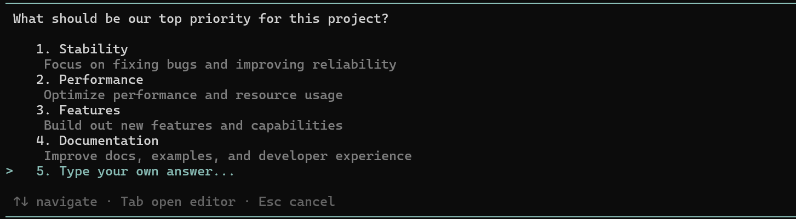
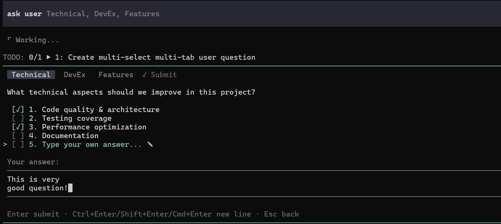
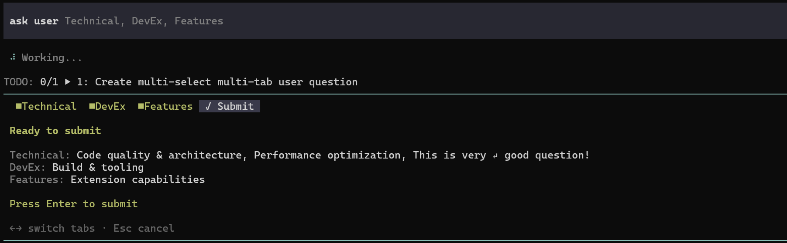

# avtc-pi-ask-user-question

A question tool for the agent — single/multi-select or free-text, with subagent forwarding and attention alerts.

Inspired by Claude Code's `AskUserQuestion` tool; originally derived from [ghoseb/pi-askuserquestion](https://github.com/ghoseb/pi-askuserquestion).

## Features

- **Single & multi-select** — pick one option or check several; each option has a label and description
- **Free-text "Other"** — every question has a row to type a custom answer
- **Multiline free-text** (`Ctrl`/`Shift`/`Cmd`+`Enter` = newline)
- **Multi-question tabs** — up to four questions in one dialog, each with a short header
- **Subagent forwarding** — questions from subagent [`avtc-pi-subagent`](https://github.com/avtc/avtc-pi-subagent) sessions are bridged [`avtc-pi-subagent-ui-bridge`](https://github.com/avtc/avtc-pi-subagent-ui-bridge) to the root UI as a single unified dialog
- **Attention alerts** — integrates with [`avtc-pi-notification`](https://github.com/avtc/avtc-pi-notification) to notify you when the agent is waiting
- **Dialog coordination** — uses [`avtc-pi-ui-components`](https://github.com/avtc/avtc-pi-ui-components) dialog coordinator to prevent overlapping dialogs across extensions.

## Tools

| Tool | Description |
|---|---|
| `ask_user_question` | Ask the user 1–4 structured questions (single-select, multi-select, or free-text) and wait for answers |

## What it looks like

**Single-select**



**Multi-select, multiple questions, and multiline free-text**



**Submit review**



## Installation

```bash
pi install npm:avtc-pi-ask-user-question
```

## Usage

Once installed, the tool is available to the agent automatically. Ask it to clarify something before proceeding — it calls `ask_user_question`, you answer in the TUI, and it continues with your answers:

```
Help me scaffold a new web app. Ask me what you need to know first.
```

## Key bindings

| Key | Action |
|---|---|
| `↑` `↓` | Move cursor |
| `Enter` | Select / confirm / submit |
| `Space` | Toggle (multi-select) |
| `Tab` | Open the free-text editor (on the "Other" row) |
| `←` `→` | Switch tabs |
| `Esc` | Cancel (or discard free-text) |

> Forked from [ghoseb/pi-askuserquestion](https://github.com/ghoseb/pi-askuserquestion) and extended with [Z.ai](https://z.ai/subscribe?ic=N5IV4LLOOV) — get 10% off your subscription via this referral link.

## License

MIT
